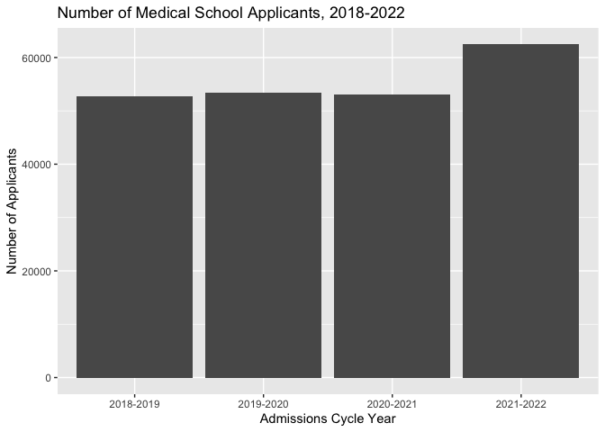

<!-- README.md is generated from README.Rmd. Please edit that file -->

# medapps2021

<!-- badges: start -->

[](https://lifecycle.r-lib.org/articles/stages.html#experimental)
[](https://CRAN.R-project.org/package=medapps2021)
<!-- badges: end -->

`medapps2021` contains tidy format data from the Association of American
Medical College’s 2021 FACTS: Applicants and Matriculants Data website.
Datasets include the mean entrance exam scores and GPAs of medical
school applicants and matriculants for the 2021-2022 admissions cycle
across several different demographics.

## Installation

You can install the development version of medapps2021 like so:

``` r
devtools::install_github("statsmed-sheep/medapps2021")
#> Downloading GitHub repo statsmed-sheep/medapps2021@HEAD
#> * checking for file ‘/private/var/folders/m3/0v7qg7ks0zqfwl1qbrhg1tmr0000gn/T/RtmprI0xfw/remotesfac4148efd4b/statsmed-sheep-medapps2021-5635ec0/DESCRIPTION’ ... OK
#> * preparing ‘medapps2021’:
#> * checking DESCRIPTION meta-information ... OK
#> * checking for LF line-endings in source and make files and shell scripts
#> * checking for empty or unneeded directories
#> * building ‘medapps2021_0.0.0.9000.tar.gz’
#> Installing package into '/private/var/folders/m3/0v7qg7ks0zqfwl1qbrhg1tmr0000gn/T/RtmpVLnTBn/temp_libpathed8f418c718'
#> (as 'lib' is unspecified)
library(medapps2021)
```

## Data

-   `astats_all`: mean total MCAT exam/sub-section scores and
    combined/science/non-science GPAs for all 2021-2022 applicants.
-   `mstats_all`: mean total MCAT exam/sub-section scores and
    combined/science/non-science GPAs for all 2021-2022 matriculants.

## Example

The tidy format of the data allows for application of tidyverse packages
like `dplyr` and `ggplot2` for data wrangling and visualization,
respectively.

``` r
library(tidyverse)
#> ── Attaching packages ─────────────────────────────────────── tidyverse 1.3.1 ──
#> ✓ ggplot2 3.3.5     ✓ purrr   0.3.4
#> ✓ tibble  3.1.6     ✓ dplyr   1.0.7
#> ✓ tidyr   1.1.4     ✓ stringr 1.4.0
#> ✓ readr   2.1.2     ✓ forcats 0.5.1
#> ── Conflicts ────────────────────────────────────────── tidyverse_conflicts() ──
#> x dplyr::filter() masks stats::filter()
#> x dplyr::lag()    masks stats::lag()
library(medapps2021)

# Data wrangling

astats_ex <- astats_all %>% 
  filter(category == "Total Applicants")

# Data visualization

ggplot(astats_ex, aes(x = year, y = number)) + 
  geom_col(position = "dodge") +
  labs(title = "Number of Medical School Applicants, 2018-2022", x = "Admissions Cycle Year", y = "Number of Applicants")
```



## Contributor(s)

Clara Li
